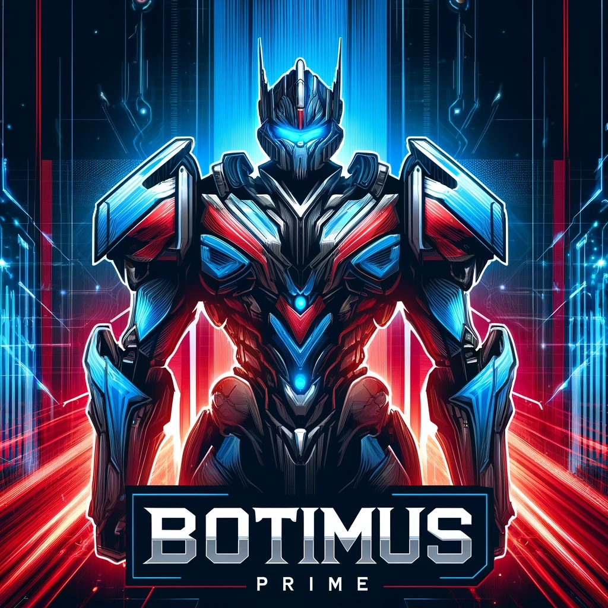
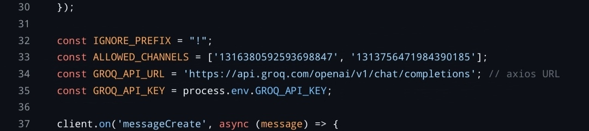
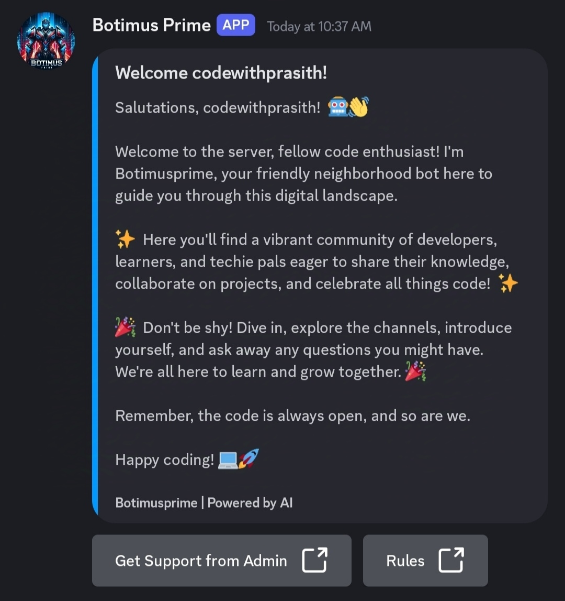
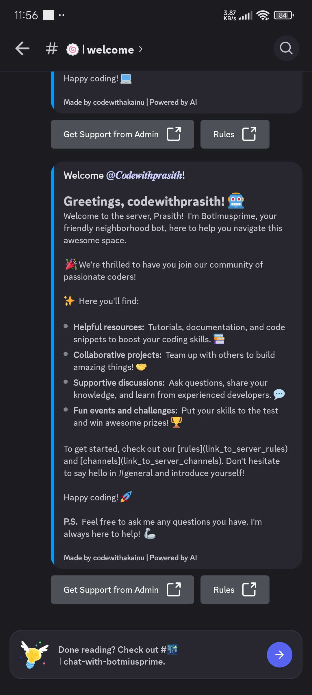

# Botimusprime-V-1.0.1

# Feature
Added auto generated welcome message using ai and added slash command to enable or disable it.

<h2>Coded by codewithakainu</h2>
Botimusprime is an ai bot that interact with people in your discord server.Make your discord server alive.
It use groq api.It doesn't support chatgpt api.If you really want the code that implement chatgpt api contact me through discord server.Don't use code for public bot without developer permission.Bot will.get copyright.

### How to set the bot?

# 🚀 Join Us

### Join Discord Guild

### Send Message on Discord

### Subscribe to YouTube Channel
https://youtube.com/@codewithakainu

<h1>Step by step to set the bot</h1>

Avoid the use of npm init -y if you are using hosting panel.

### download node.js and use
    npm init -y
    
### packages to install
    npm install discord.js
    npm install dotenv
    npm install axios

### In .env file
    set the variable in .env file

### change the channel_id in the index.js with your channel_id

### First run registration command for the bot to register slash command to bot.
    node register-command.js

### Command to run the code in vscode or other code editor and vps
    node index.js

### start up command for hosting panel
    
### New updates will be coming soon by codewithakainu 

### Feature

# Give feedback about my code in the discord server it will makes me happy 😁.
